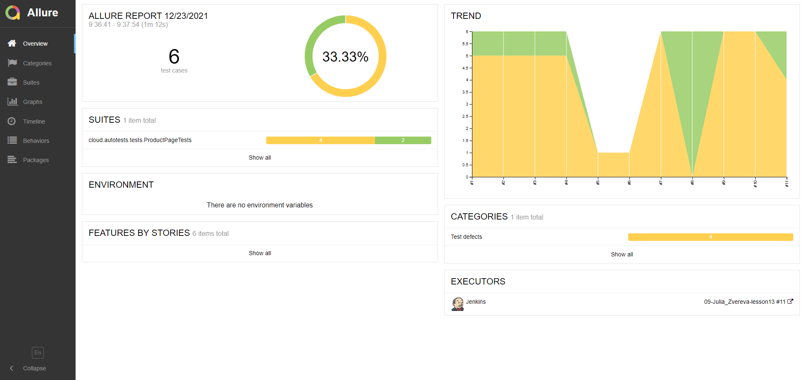

# UI автотесты для страницы товара на сайте petshop.ru

## Cписок проверок:

- [x] Присутствие названия товара в заголовке страницы
- [x] Присутствие названия товара на странице товара
- [x] Присутствие артикула товара на странице товара
- [x] Появление уведомления об успешном добавлении при добавлении товара в корзину
- [x] Отображение количества добавленного товара на кнопке добавления в корзину после добавления товара в корзину
- [x] Отображение надписи "Добавить еще" на кнопке добавления в корзину после добавления товара в корзину

## Стек технологий:


Java, Gradle, JUnit5, Selenide, Selenoid, Allure Reports, Allure TestOps, Jenkins,  Telegram,  Intelij IDEA, Git

### Для запуска локально
```
gradle clean test
```

### Для запуска удаленно
```bash
clean
test
-Dbrowser=${BROWSER}
-DbrowserVersion=${BROWSER_VERSION}
-DbrowserSize=${BROWSER_SIZE}
-DbrowserMobileView="${BROWSER_MOBILE}"
-DremoteDriverUrl=${REMOTE_DRIVER_URL}
-DvideoStorage=https://${REMOTE_DRIVER_URL}/video/
-Dthreads=${THREADS}
```


## Для запусков автотестов используется Jenkins.

##### Пример готовой сборки можно посмотреть [по ссылке](https://jenkins.autotests.cloud/job/09-Julia_Zvereva-lesson13/)

### Параметры запуска в Jenkins


### Статистика запусков в Jenkins


### Отчёт о прохождении автотестов в Allure Report


### Список автотестов в Allure Report


### Хранение тестовой документации в Allure TestOps


### Прохождение тестов в Allure TestOps


### Уведомления о прохождении автотестов в Telegram


### Видео о прохождении тестов
